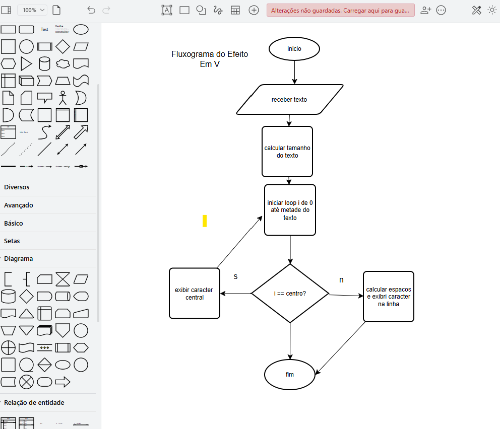

# **Projeto de Programação em Python**

## **Descrição do Projeto**
Este projeto consiste em dois componentes principais:
1. **Efeitos Especiais no Texto:** Um script para aplicar diversos efeitos visuais em texto fornecido pela linha de comando.
2. **L2ADDR:** Um utilitário que resolve endereços MAC a partir de endereços IPv4, com suporte opcional para refrescar a cache ARP.

O desenvolvimento foi realizado em um workspace do Visual Studio Code, aproveitando a organização de arquivos e ferramentas integradas. Este projeto também inclui fluxogramas e documentação dos algoritmos implementados.

## **Estrutura do Projeto**
```plaintext
/Projecto1
├── /fluxogramas                # Fluxogramas do projeto
│     ├── fluxogramaEfeitoV.png       # Fluxograma do efeito Em V
│     ├── fluxogramaEfeitoTexto.png   # Fluxograma do efeito Texto Deslizante
│     ├── fluxogramaL2ADDR.png        # Fluxograma do utilitário L2ADDR
├── efeitos.py                  # Efeitos especiais no texto
├── L2ADDR.py                   # Utilitário para resolver endereços MAC
├── README.md                   # Documentação do projeto


- **Efeito Em V:**  


- **Texto Deslizante:**  


- **L2ADDR:**  

